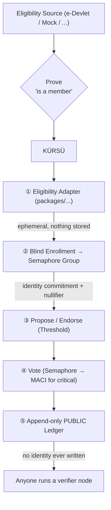

> **English** | [Türkçe](README.tr.md)

# KÜRSÜ: An Open, Verifiable, Decentralized Platform for Grassroots Governance


KÜRSÜ is an independent, open-source civic-technology project designed to empower grassroots communities. It provides a platform for members to propose and vote on initiatives anonymously, with one-member-one-vote integrity, all recorded on a fully public ledger that anyone can audit. KÜRSÜ is NOT an organ of any political party and produces NO binding decisions; it is a consultative "voice of the base" instrument.

## ⚠️ **IMPORTANT: THIS IS NOT A REAL VOTING SYSTEM YET.**

The cryptography is currently being integrated and **has not been audited**. Until the security audit (ticket `M08`) is complete, every deployment MUST display a clear "DEMO — not a real vote" banner. A bug here does not lose money; it loses legitimacy — which is the entire point of the project. **Do not use this to make binding decisions.**

## Why KÜRSÜ Exists

Traditional delegate chains often obscure the true preferences of a community, making them unmeasurable and easily ignored. KÜRSÜ addresses this by making community preferences **verifiable but secret**: undeniable in aggregate, yet invisible per person. It is built on principles of openness, transparency, and decentralization, ensuring that if any central entity attempts to compromise the system, the community can easily fork and continue its work. For more details, see [`GOVERNANCE.md`](./GOVERNANCE.md).

## What KÜRSÜ Brings to the Table

KÜRSÜ builds upon established cryptographic primitives, primarily from the Ethereum Foundation's Privacy & Scaling Explorations team, to avoid reinventing the wheel. We leverage:

*   **Semaphore**: For anonymous group membership and ensuring one-signal-per-scope (nullifiers).
*   **MACI (Minimal Anti-Collusion Infrastructure)**: To provide coercion and bribery resistance for high-stakes votes.

Our unique contributions, detailed further in [`docs/PRIOR_ART.md`](./docs/PRIOR_ART.md), include:

1.  **Pluggable Eligibility Bridge**: A flexible system for verifying membership, with a reference adapter for e-Devlet party membership via barcode/zkTLS (a greenfield, complex module).
2.  **Grassroots Governance Layer**: Mechanisms for proposal thresholds, a *votable rule* system, and soulbound one-member-one-vote implementation.
3.  **Transparent Treasury**: A public ledger for logging all financial transactions alongside votes, ensuring full financial transparency (see [`TREASURY.md`](./TREASURY.md)).

## High-Level Architecture



For a more in-depth understanding, please refer to:
*   **Full Architecture Details**: [`docs/ARCHITECTURE.md`](./docs/ARCHITECTURE.md)
*   **Threat Model**: [`docs/THREAT_MODEL.md`](./docs/THREAT_MODEL.md)
*   **Data Privacy (KVKK)**: [`docs/KVKK.md`](./docs/KVKK.md)

## Getting Started (Quickstart)

To set up KÜRSÜ for local development, follow these steps:

### Prerequisites

Ensure you have the following installed:

*   **Node.js**: Version 20 or higher.
*   **pnpm**: For efficient monorepo package management.

### Installation and Running

1.  **Install dependencies:**
    ```bash
    pnpm install
    ```
2.  **Configure environment variables:**
    ```bash
    cp .env.example .env
    ```
    *By default, this configuration uses a **MOCKED** eligibility adapter for demonstration purposes. Crypto operations are simulated, and a "DEMO — not a real vote" banner will be displayed. This is intentional to provide a believable demo without real-world implications.*
3.  **Start the development server:**
    ```bash
    pnpm dev
    ```
    This command will launch both the relayer and the web application. Access the web app at `http://localhost:5173`.

## Verify It Yourself

KÜRSÜ operates on the principle of "don't trust, verify." The public ledger is an append-only, hash-chained log. You can run your own verifier to independently recompute the tally:

```bash
pnpm --filter @kursu/ledger verify ./path-to-ledger.jsonl
```

## Contributing

We welcome contributions from developers, designers, and anyone passionate about decentralized governance. Please see our comprehensive [CONTRIBUTING.md](./CONTRIBUTING.md) guide for detailed instructions on how to get involved, including:

*   Setting up your development environment.
*   Finding tasks (look for `good first issue` and `help wanted` labels).
*   Our contribution workflow (forking, branching, committing, and Pull Requests).
*   Code style, testing, and documentation standards.

Refer to the [ROADMAP.md](ROADMAP.md) for an overview of our project's future direction.

## Funding

KÜRSÜ is a commons project, taking no equity and having no single owner. All financial transactions are logged on the same public ledger as votes, ensuring complete transparency. Details can be found in [`TREASURY.md`](./TREASURY.md).

## License

This project is licensed under the [AGPL-3.0-only License](./LICENSE). This license was chosen specifically to ensure that any deployment, including hosted services, must keep its source open. This principle is fundamental to maintaining the commons and preventing the capture of the platform. (If you consider forking for a different philosophy, be aware of the implications of switching to licenses like MIT/Apache-2.0.)

---

*KÜRSÜ is an independent open-source civic-technology project. It is NOT an organ of any political party and produces NO binding decisions; it is a consultative, "voice of the base" instrument.*
