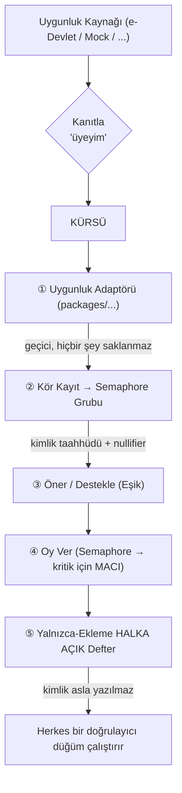

> [English](README.md) | **Türkçe**

# KÜRSÜ: Tabandan Yönetişim İçin Açık, Doğrulanabilir, Merkezsiz Bir Platform


KÜRSÜ, taban topluluklarını güçlendirmek için tasarlanmış, bağımsız ve açık
kaynaklı bir sivil-teknoloji projesidir. Üyelerin önerileri **anonim** olarak
oylayabildiği, **bir üye–bir oy** bütünlüğüne sahip ve herkesin denetleyebileceği
**tamamen halka açık bir deftere** kaydedilen bir platform sağlar. KÜRSÜ
herhangi bir siyasi partinin organı **değildir** ve **bağlayıcı kararlar
üretmez**; tabanın sesini ölçen, danışsal bir “taban sesi” aracıdır.

## ⚠️ **ÖNEMLİ: BU HENÜZ GERÇEK BİR OYLAMA SİSTEMİ DEĞİLDİR.**

Kriptografi şu anda entegre ediliyor ve **denetlenmemiştir**. Güvenlik
denetimi (ticket `M08`) tamamlanana kadar her dağıtım, açık bir
**“DEMO — gerçek bir oylama değildir”** bandı göstermek zorundadır. Buradaki
bir hata para kaybettirmez; meşruiyet kaybettirir — ki projenin tüm anlamı
budur. **Bağlayıcı kararlar almak için kullanmayın.**

## KÜRSÜ Neden Var?

Geleneksel temsil zincirleri çoğu zaman bir topluluğun gerçek tercihlerini
örter, bu tercihleri ölçülemez hâle getirir ve kolayca görmezden gelinmesini
sağlar. KÜRSÜ bu durumu, topluluk tercihlerini **doğrulanabilir ama gizli**
kılarak çözer: toplamda yadsınamaz, kişi başında görünmez. Açıklık,
şeffaflık ve merkezsizlik ilkeleri üzerine kuruludur; bu sayede herhangi bir
merkezî yapı sistemi ele geçirmeye kalkışırsa topluluk kolayca **çatallayıp
(fork)** işine devam edebilir. Daha fazlası için bkz. [`GOVERNANCE.md`](./GOVERNANCE.md).

## KÜRSÜ Masaya Ne Getiriyor?

KÜRSÜ, tekerleği yeniden icat etmemek için öncelikle Ethereum Foundation’ın
Privacy & Scaling Explorations ekibinin yerleşik kriptografik
primitiflerini temel alır:

*   **Semaphore**: anonim grup üyeliği ve kapsam başına tek-sinyal (nullifier).
*   **MACI (Minimal Anti-Collusion Infrastructure)**: yüksek-önemli oylamalar
    için zorlama ve rüşvete karşı direnç.

Bizim özgün katkılarımız — [`docs/PRIOR_ART.md`](./docs/PRIOR_ART.md) içinde
daha ayrıntılı — şunlardır:

1.  **Takılıp-çıkarılabilir Uygunluk Köprüsü**: üyelik doğrulama için esnek
    bir sistem; barkod/zkTLS aracılığıyla e-Devlet parti üyeliğini referans
    olarak alan bir adaptörle (greenfield, karmaşık bir modül).
2.  **Tabandan Yönetişim Katmanı**: öneri eşikleri, *oylanabilir kural*
    sistemi ve ruha-bağlı (soulbound) bir üye–bir oy uygulaması.
3.  **Şeffaf Hazine**: tüm finansal hareketleri oylarla aynı halka açık deftere
    kaydederek finansal şeffaflığı tam sağlayan bir hazine (bkz.
    [`TREASURY.md`](./TREASURY.md)).

## Üst Düzey Mimari



Daha derin bir okuma için:
*   **Tam Mimari**: [`docs/ARCHITECTURE.md`](./docs/ARCHITECTURE.md)
*   **Tehdit Modeli**: [`docs/THREAT_MODEL.md`](./docs/THREAT_MODEL.md)
*   **Veri Gizliliği (KVKK)**: [`docs/KVKK.tr.md`](./docs/KVKK.tr.md)

## Başlangıç (Hızlı Kurulum)

KÜRSÜ’yü yerel geliştirme için hazırlamak için:

### Gereksinimler

Aşağıdakilerin kurulu olması gerekir:

*   **Node.js**: 20 ve üzeri.
*   **pnpm**: monorepo paket yönetimi için.

### Kurulum ve Çalıştırma

1.  **Bağımlılıkları yükleyin:**
    ```bash
    pnpm install
    ```
2.  **Ortam değişkenlerini ayarlayın:**
    ```bash
    cp .env.example .env
    ```
    *Varsayılan olarak bu yapılandırma demonstrasyon amaçlı **MOCK** bir
    uygunluk adaptörü kullanır. Kriptografi işlemleri simüle edilir ve
    “DEMO — gerçek bir oylama değildir” bandı görüntülenir. Bu, gerçek dünya
    sonuçları olmadan inandırıcı bir demo sunmak için kasıtlıdır.*
3.  **Geliştirme sunucusunu başlatın:**
    ```bash
    pnpm dev
    ```
    Bu komut hem relayer’ı hem de web uygulamasını başlatır. Web uygulamasına
    `http://localhost:5173` üzerinden erişebilirsiniz.

## Kendiniz Doğrulayın

KÜRSÜ “güvenme, doğrula” ilkesi üzerine çalışır. Halka açık defter, hash
zincirli, yalnızca-ekleme bir günlüktür. Kendi doğrulayıcınızı çalıştırarak
sayımı bağımsız biçimde yeniden hesaplayabilirsiniz:

```bash
pnpm --filter @kursu/ledger verify ./defter-dosyasi-yolu.jsonl
```

## Katkıda Bulunma

Geliştiricilerden, tasarımcılardan ve merkezsiz yönetişim konusunda hevesli
herkesten katkı bekliyoruz. Ayrıntılar için kapsamlı
[CONTRIBUTING.tr.md](./CONTRIBUTING.tr.md) belgesine bakın; orada şunlar var:

*   Geliştirme ortamınızı kurma.
*   Yapılacak iş bulma (`good first issue` ve `help wanted` etiketleri).
*   Katkı iş akışımız (fork, branch, commit, Pull Request).
*   Kod stili, test ve dokümantasyon standartları.

Projenin yönü için [ROADMAP.md](ROADMAP.md) belgesine bakın.

## Finansman

KÜRSÜ bir müşterek varlık projesidir; pay (equity) almaz, tek sahibi yoktur.
Tüm finansal hareketler, oylarla aynı halka açık deftere kaydedilir; böylece
tam şeffaflık sağlanır. Ayrıntılar [`TREASURY.md`](./TREASURY.md) içinde.

## Lisans

Bu proje [AGPL-3.0-only Lisansı](./LICENSE) altında lisanslanmıştır. Bu
lisans, hosting hizmetleri dâhil her dağıtımın kaynağını açık tutmak
zorunda kalmasını sağlamak için özellikle seçilmiştir. Bu ilke, müştereği
korumak ve platformun ele geçirilmesini önlemek için temeldir. (Farklı bir
felsefe için çatallama düşünüyorsanız, MIT/Apache-2.0 gibi lisanslara
geçişin sonuçlarını göz önünde bulundurun.)

---

*KÜRSÜ, bağımsız bir açık kaynaklı sivil-teknoloji projesidir. Bir siyasi
partinin organı **değildir** ve **bağlayıcı kararlar üretmez**; tabanın sesini
yansıtan, danışsal bir araçtır.*
